# 其他json解析器

1. 可定制性

Jackson有灵活的API，可以很容易进行扩展和定制，而且很多时候需要的模块都已经有人提供了。比如guava中定义的数据类型，比如kotlin语言Immutable的类型等，比如java8 引入的新日期时间类型和Optional都已经有支持的模块。

FastJson只有一个(简陋)的SerializeFilter机制用来定制序列化，ParseProcess机制用来定制反序列化，每次调用序列化/反序列化的的时候都要自己传filter或者Process这个参数过去，Jackson和 Gson都是直接注册模块就可以了，Jackson还可以使用SPI来自动发现和注册模块。

2. 代码质量
公司有一些项目使用了Fastjson，在使用Fastjson的项目里面曾碰到过的两个低级bug:

碰到在128~255 的字符直接异常，这些主要是西欧语言的字符，因为他用一个数组来记录 转义后的字符表示，但是数组长度只有128...

内存占用过多。Fastjson为了性能，在ThreadLocal中缓存了char[] buffer，这样避免分配内存和gc的开销。但是如果碰到了大的json(比如10M这样的)，就会占用大量的内存，而且以后都是处理小JSON了内存占用也回不来。

这些问题虽然后来的版本都修复了，但是也反映出Fastjson代码质量上要求不够严格。而Jackson这么多年来使用上还没有碰到过这样的Bug.

3. 文档
相比Jackson, Fastjson英文文档就显得比较欠缺，已有的也不规范，这样就更没法指望老外用了，相对还是国内开发者占大多数

# redis中的hash

在Redis中，Hash（哈希）是一种数据类型，它的作用类似于传统的哈希表。

Redis的Hash类型可以存储多个键值对，非常适合用于存储对象和对象属性，如用户信息、商品详情等。

Hash在Redis中以一种紧凑的方式存储数据，对于大量小对象的存储效率非常高。

使用场景

存储对象属性：Redis Hash非常适合用于存储具有多个属性的对象。例如，可以用Hash存储用户信息，商品详情等。

轻量级的数据结构：对于存储相对较小的数据，Hash可以非常高效地使用内存。对于包含少量字段的对象，Hash的内存开销比存储成多个独立的字符串键值对更低。

高效的访问：Hash的字段访问时间复杂度为O(1)，可以非常高效地进行读写操作。

内部编码优化

Redis对Hash的内部实现进行了优化，根据哈希表中键值对的数量和每个键值对的大小，采用不同的编码方式来存储数据：

Ziplist（压缩列表）：对于元素数量较少且每个元素较小的Hash，Redis使用Ziplist（压缩列表）编码来节省内存。

Hashtable（哈希表）：当Hash的元素数量增多或元素变大时，Redis会自动将Ziplist编码转换为Hashtable编码，以提高访问效率。

这些优化使得Redis Hash能够在不同场景下都能保持高效的性能。

总结

Redis Hash是一种强大的数据类型，适用于存储和操作多字段的对象。

通过提供一系列丰富的命令，Redis使得操作哈希表非常简便。同时，内部的编码优化使得Hash在存储和访问小数据时也能保持高效。

在设计和实现基于Redis的应用时，合理使用Hash可以显著提高系统的性能和资源利用率。

# 二叉排序树和堆的应用场景

二叉排序树是一种特殊的二叉树，它满足以下性质：

每个节点都有一个关键字，且关键字可以是任何类型，比如整数、字符串等。
二叉排序树是一棵二叉树，因此它满足二叉树的基本性质，比如每个节点最多有两个子节点，左子树和右子树是二叉排序树等。
如果左子树不为空，那么左子树上所有节点的关键字都小于当前节点的关键字。
如果右子树不为空，那么右子树上所有节点的关键字都大于当前节点的关键字。
左子树和右子树也都是二叉排序树。

应用场景

数据库系统：在数据库系统中，二叉排序树可以用于索引的实现。例如，在关系型数据库中，可以使用 B+树作为索引结构，以加快查询速度。
    
文件系统：在文件系统中，二叉排序树可以用于存储文件和目录的层次结构。通过二叉排序树的查找算法，可以快速找到目标文件或目录。
    
搜索引擎：在搜索引擎中，二叉排序树可以用于实现关键字的排序和查找。通过对关键字进行排序，可以提高搜索的准确性和效率。
    
游戏开发：在游戏开发中，二叉排序树可以用于实现地图的管理和导航。通过二叉排序树的查找算法，可以快速找到目标位置，提高游戏的流畅性。
    
总之，二叉排序树是一种非常实用的数据结构，它在很多商业化应用中都有广泛的应用。通过合理地使用二叉排序树，可以提高系统的性能和效率。


堆是一种特殊的树。只要满足以下两点，就称为堆。

堆是一个完全二叉树。
堆的每一个节点的值都必须大于等于（或小于等于）其子树中每个节点的值。

对于每个节点的值都大于等于其子树中每个节点的值的堆，我们叫做“大顶堆”。对于每个节点的值都小于等于其子树中每个节点的值的堆，我们叫做“小顶堆”。

堆的应用

1.优先级队列
    
优先级队列，顾名思义，它首先是一个队列。队列的最大特性就是先进先出。但是，在优先级队列中，出队的顺序不是按照先进先出，而是按照优先级来，优先级高的先出队。     

如何实现一个优先级队列呢？其实有很多方法，不过使用堆来实现是最直接、最高效的。因为堆和优先级队列非常相似。一个堆就可以看做是一个优先级队列。往优先级队列中插入一个元素，就相当于往堆中插入一个元素；从优先级队列中取出最高优先级的元素，就相当于取出堆顶元素。我们来看一下下面这样一个应用场景。

假如我们有100个小文件，每个文件的大小是100MB。每个文件中存储的都是有序的字符串。我们希望将这些小文件合并成一个有序大文件。这里就会用到优先级队列。我们将从100个小文件中，各取出一个字符串，然后我们建立小顶堆，那堆顶的元素，也就是优先级队列的队首元素，也就是最小的字符串。我们将这个字符串放到大文件中，并将其从堆中删除。然后再从小文件中取出下一个字符串放入堆中。循环此过程，就可以将100个小文件的数据依次放入到大文件中。

2.利用堆求topK

我们可以把求topk的问题抽象成2类。一类是针对静态数据集合，也就是说数据集合事先确定，不会再变。另一类是针对动态数据集合，也就是说数据集合事先不确定，有数据动态地加入到集合中。    针对静态数据集合，如何在包含n个数据的数组中，查找前K大数据呢?我们可以维护一个大小为k的小顶堆，顺序遍历数组，从数组中取出数据和堆顶元素比较。如果比堆顶元素大，我们就把堆顶元素删除，并且将这个元素插入到堆中；如果比堆顶元素小，我们就不做处理，继续遍历数组。这样等数组中的数据都遍历完成之后，堆中的数据就是前K大数据了。    针对动态数据求得topK，也就是实时topK。怎么理解呢？我举个例子。一个数据集合中有两个操作，一个是添加数据，另一个就是询问当前的前K大数据。     如果每次询问前k大数据时，我们都基于当前的数据重新计算的话，那时间复杂度就是O(nlogN)，n表示当前数据的大小。实际上我们可以一直维护一个k大小的小顶堆，当有数据要添加到集合中时，我们就拿它与堆顶元素做对比。如果比堆顶元素大，我们把堆顶元素删除，并将这个元素插入到堆中；如果比堆顶元素小，我们则不做处理。这样，不论何时需要查询前K大数据，我们都可以立刻返回给它。

# -proc

Linux下如何用/proc命令查找进程状态信息——当前目录，内存占用，描述符等

Linux系统上的/proc目录是一种文件系统，即proc文件系统。与其它常见的文件系统不同的是，/proc是一种伪文件系统（也即虚拟文件系统），存储的是当前内核运行状态的一系列特殊文件，用户可以通过这些文件查看有关系统硬件及当前正在运行进程的信息，甚至可以通过更改其中某些文件来改变内核的运行状态。这个目录中包含每个进程的状态信息。

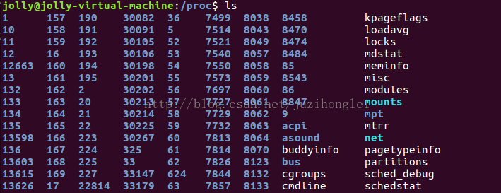

可以看到，/proc中包含一个对应pid=34234的目录：

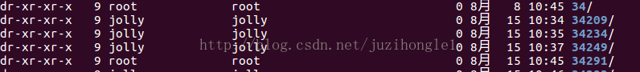

注：大概是因为/proc是一个伪文件系统。其内的文件也常被称作虚拟文件，并具有一些独特的特点。例如，其中有些文件虽然使用查看命令查看时会返回大量信息，但文件本身的大小却会显示为0字节。

# hash表的性质

哈希表（Hash Table）是一种用于实现快速查找的数据结构。

哈希表通过一个哈希函数将键（Key）映射到数组中的一个位置，以便快速地插入、删除和查找数据。

以下是哈希表的主要性质和相关概念：

1. 哈希函数（Hash Function）

定义：哈希函数是一个函数，它接受一个键并返回该键在哈希表中的索引。理想情况下，哈希函数能将键均匀分布到哈希表的各个位置。

要求：

确定性：对于相同的输入，哈希函数应始终返回相同的输出。

均匀分布：理想的哈希函数应尽量将输入均匀分布到哈希表中，减少冲突。

高效计算：哈希函数应能快速计算。

2. 哈希冲突（Hash Collision）

定义：哈希冲突是指不同的键通过哈希函数映射到相同的索引位置。

处理方法：

链地址法（Separate Chaining）：每个哈希表的槽位保存一个链表，所有映射到同一槽位的元素都插入到这个链表中。

开放地址法（Open Addressing）：当冲突发生时，寻找其他空闲槽位存放冲突的元素。常见的方法有线性探测、二次探测和双重哈希。

3. 哈希表的操作

插入（Insertion）：将键值对插入哈希表中。需要计算键的哈希值并找到合适的槽位。如果发生冲突，根据冲突处理方法进行处理。

查找（Search）：根据键查找对应的值。需要计算键的哈希值并检查相应槽位的元素，如果发生冲突，根据冲突处理方法查找。

删除（Deletion）：从哈希表中删除键值对。需要计算键的哈希值并找到相应槽位的元素，如果发生冲突，根据冲突处理方法进行删除。

4. 哈希表的性能

时间复杂度：

平均情况：O(1) 时间复杂度，无论是插入、查找还是删除操作。

最坏情况：O(n) 时间复杂度，当所有键都映射到同一个槽位时（如哈希函数失效或表负载因子过高）。

空间复杂度：哈希表的空间复杂度取决于表的大小和冲突处理方法。链地址法需要额外的空间存储链表，开放地址法需要额外的空间解决冲突。

5. 负载因子（Load Factor）

定义：负载因子是哈希表中元素数量与槽位数量的比值。

影响：负载因子影响哈希表的性能。高负载因子增加冲突概率，降低性能；低负载因子则意味着更多的空闲槽位，浪费内存。

动态扩展：当负载因子超过某个阈值时，哈希表通常会进行扩展（rehash），增加槽位数量并重新分布已有的元素。

6. 哈希表的优缺点

优点：

高效：平均情况下，哈希表的查找、插入和删除操作都能在常数时间内完成。

灵活：可以用于实现许多其他数据结构，如集合和映射。

缺点：

内存开销：哈希表通常需要额外的空间来处理冲突。

最坏情况性能：在极端情况下，哈希表的性能可能退化为线性时间。

无序：哈希表不保持元素的顺序，对于需要顺序访问的应用不适用。

总结

哈希表是一种高效的数据结构，广泛应用于需要快速查找、插入和删除的场景。

其核心在于哈希函数的设计和冲突处理机制。通过理解哈希表的性质和实现细节，可以更好地利用这种数据结构解决实际问题。

# 协程库中的receive为阻塞还是非阻塞

# 查看port指令

Linux 查看端口占用情况

1. 使用 netstat 命令
netstat 是一个用于显示网络状态信息的命令。要查看特定端口是否被占用，可以使用以下命令：

netstat -tuln | grep 端口号

-t: 显示 TCP 连接信息

-u: 显示 UDP 连接信息

-l: 仅显示监听状态的端口

-n: 使用数字格式显示端口号，而不是服务名

grep 端口号: 使用 grep 命令过滤出指定的端口号信息

例如，要查看端口号 80 是否被占用，可以执行：

netstat -tuln | grep 80

2. 使用 ss 命令
ss 是一个更现代化的工具，用于显示套接字统计信息。它比 netstat 更快速和高效。要查看端口占用情况，可以使用以下命令：

ss -tuln | grep 端口号

-t: 显示 TCP 连接信息

-u: 显示 UDP 连接信息

-l: 仅显示监听状态的端口

-n: 使用数字格式显示端口号，而不是服务名

grep 端口号: 使用 grep 命令过滤出指定的端口号信息

例如，要查看端口号 80 是否被占用，可以执行：

ss -tuln | grep 80

3. 查看所有端口占用情况
如果你想查看系统上所有端口的占用情况，只需省略 grep 命令即可：

使用 netstat：

netstat -tuln

或者使用 ss：

ss -tuln

这将显示所有 TCP 和 UDP 端口的监听情况。

# top指令的表头

Linux top 是一个在 Linux 和其他类 Unix 系统上常用的实时系统监控工具。它提供了一个动态的、交互式的实时视图，显示系统的整体性能信息以及正在运行的进程的相关信息。

使用权限：所有使用者。

## top [-] [d delay] [q] [c] [S] [s] [i] [n] [b]

-d <秒数>：指定 top 命令的刷新时间间隔，单位为秒。

-n <次数>：指定 top 命令运行的次数后自动退出。

-p <进程ID>：仅显示指定进程ID的信息。

-u <用户名>：仅显示指定用户名的进程信息。

-H：在进程信息中显示线程详细信息。

-i：不显示闲置（idle）或无用的进程。

-b：以批处理（batch）模式运行，直接将结果输出到文件。

-c：显示完整的命令行而不截断。

-S：累计显示进程的 CPU 使用时间。

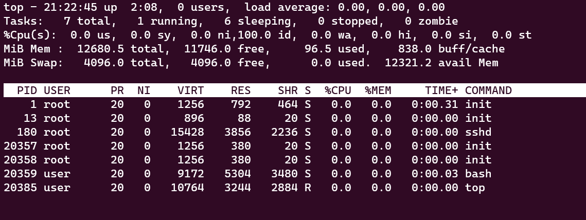

总体系统信息：

uptime：系统的运行时间和平均负载。

tasks：当前运行的进程和线程数目。

CPU：总体 CPU 使用率和各个核心的使用情况。

内存（Memory）：总体内存使用情况、可用内存和缓存。

进程信息：

PID：进程的标识符。

USER：运行进程的用户名。

PR（优先级）：进程的优先级。

NI（Nice值）：进程的优先级调整值。

VIRT（虚拟内存）：进程使用的虚拟内存大小。

RES（常驻内存）：进程实际使用的物理内存大小。

SHR（共享内存）：进程共享的内存大小。

%CPU：进程占用 CPU 的使用率。

%MEM：进程占用内存的使用率。

TIME+：进程的累计 CPU 时间。

功能和交互操作：

按键命令：在 top 运行时可以使用一些按键命令进行操作，如按下 "k" 可以终止一个进程，按下 "h" 可以显示帮助信息等。

排序：可以按照 CPU 使用率、内存使用率、进程 ID 等对进程进行排序。

刷新频率：可以设置 top 的刷新频率，以便动态查看系统信息。


# 堆栈增长方向、大小端

大小端问题：

小端：是指数据的高字节保存在内存的高地址中，而数据的低字节保存在内存的低地址中，这种存储模式将地址的高低和数据位权有效地结合起来，高地址部分权值高，低地址部分权值低。如Intel  x86结构就是使用小端模式。

大端：是指数据的高字节保存在内存的低地址中，而数据的低字节保存在内存的高地址中，这样的存储模式有点儿类似于把数据当作字符串顺序处理：地址由小向大增加，而数据从高位往低位放；这和我们的阅读习惯一致。如IBM  power PC结构就是使用的大端模式。

如何理解：首先要知道不管是大端还是小端，cpu在读取和存储数据的时候一定都是从内存的低地址依次向高地址读取或写入。

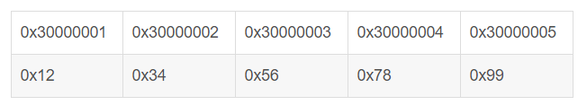

假设A（大端模式）存储如上图的数据，他要将该数据发送给B（小端模式），该数据在A中表示为多少？那么B接收的数据是多少？该数据在内存中的分布是什么样的？

该数据在A中表示为1234567899，因为数据的高字节保存在内存的低地址中。

根据cpu在读写数据的时候一定都是从内存的低地址依次向高地址读写的原则，0x12先读取并发送给B，存储到B的低地址处，然后是0x34、...0x99。发送完毕后，该数据在B中的内存分布和A中一样，没错，一样。

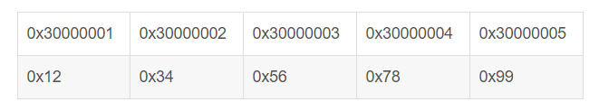

该数据在A中表示为9987654321，因为数据的高字节保存在内存的高地址中。


堆栈和内存增长方向问题：

堆：生长方向是向上的，也就是向着内存地址增加的方向。通常我们在画内存四区图时，堆的开口是向上的。

栈：它的生长方式是向下的，是向着内存地址减小的方向增长。栈的开口是向下的，上面的底部是栈底，下面的开口是栈顶。

在内存中，“堆”和“栈”共用全部的自由空间，只不过各自的起始地址和增长方向不同，它们之间并没有一个固定的界限，如果在运行时，“堆”和 “栈”增长到发生了相互覆盖时，称为“栈堆冲突”，系统崩溃。

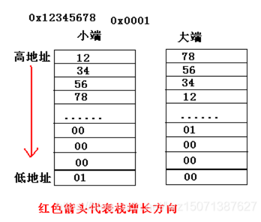

一般操作系统都是小端，而通讯协议是大端的。


# listen函数的参数

listen函数仅由TCP服务器调用，它做两件事：

当socket函数创建一个套接字时，它被假设为一个主动套接字，也就是说，它是一个将调用connect发起连接的客户套接字。listen函数把一个未连接的套接字转换为一个被动套接字，指示内核应该接受指向该套接字的连接请求。根据TCP状态转换图，调用listen导致套接字从CLOSED状态转换到LISTEN状态。

listen函数的第二个参数规定了内核应该为相应套接字排队的最大连接个数：

#include<sys/socket.h>
int listen(0531/int sockfd, int backlog);
返回：若成功则为0，若出错则为-1

为了理解其中的backlog参数，我们必须认识到内核为任何一个给定的监听套接字维护两个队列：

未完成连接队列，每个这样的SYN分节对应其中一项：已由某个客户发出并到达服务器，而服务器正在等待完成相应的TCP三路握手过程。这些套接字处于SYN_RECV状态

已完成连接队列，每个已完成TCP三路握手过程的客户对应其中一项。这些套接字处于ESTABLISHED状态。

下图描绘了监听套接字的两个队列

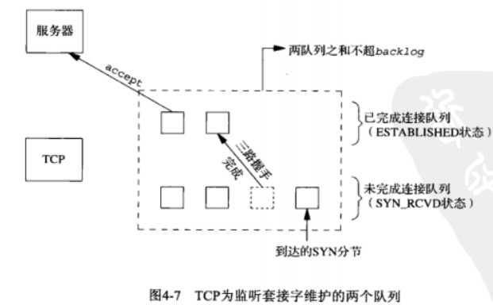

每当在未完成连接队列中创建一项时，来自监听套接字的参数就复制到即将建立的连接中，连接的创建机制是完全自动的。无需服务器进程插手。下图展示了用这两个队列建立连接时所交换的分组：

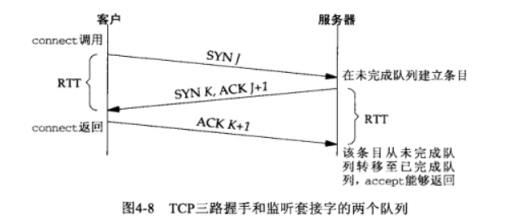

当来自客户的SYN到达时，TCP在未完成连接队列中创建一个新项，然后响应以三路握手的第二个分节：服务器的SYN响应，其中捎带对客户SYN的ACK。这一项一直保留在未完成连接队列中，直到三路握手的第三个分节(客户对服务器的SYN的ACK)到达或者该项超时为止。

如果三路握手正常完成，该项从未完成连接队列移到已完成连接队列的队尾。当进程调用accept时，已完成连接队列中的队头项将返回给进程，或者该队列为空，那么进程就被投入睡眠，直到TCP在该队列中放入一项才唤醒它。


# epoll如何封装

# CPU执行指令过程

现代大多数 CPU 都使用来流水线的方式来执行指令，所谓的流水线就是把一个任务拆分成多个小任务，于是一条指令通常分为 4 个阶段，称为 4 级流水线，如下图：

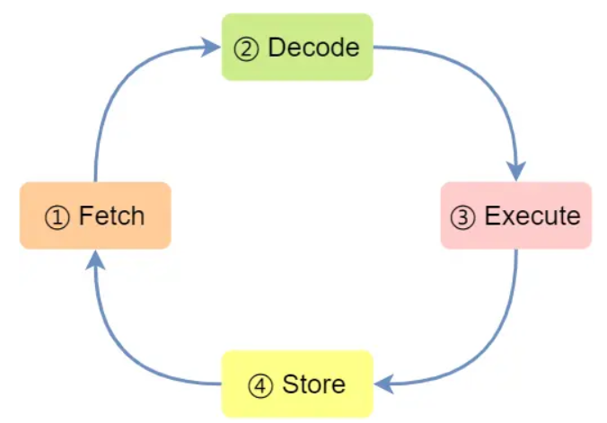

CPU 通过程序计数器读取对应内存地址的指令，这个部分称为 Fetch（取得指令）；
CPU 对指令进行解码，这个部分称为 Decode（指令译码）；
CPU 执行指令，这个部分称为 Execution（执行指令）；
CPU 将计算结果存回寄存器或者将寄存器的值存入内存，这个部分称为 Store（数据回写）；

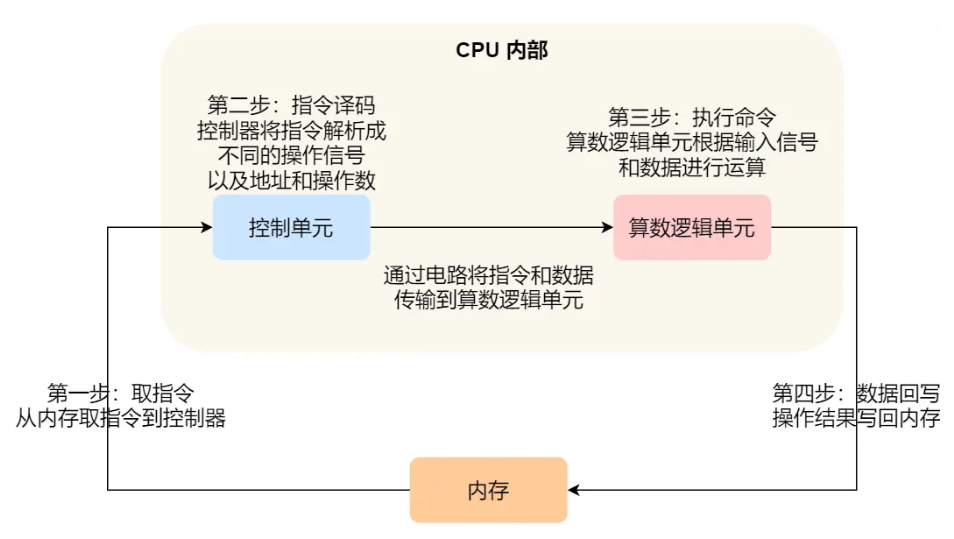

取指令的阶段，我们的指令是存放在存储器里的，实际上，通过程序计数器和指令寄存器取出指令的过程，是由控制器操作的；
指令的译码过程，也是由控制器进行的；
指令执行的过程，无论是进行算术操作、逻辑操作，还是进行数据传输、条件分支操作，都是由算术逻辑单元操作的，也就是由运算器处理的。但是如果是一个简单的无条件地址跳转，则是直接在控制器里面完成的，不需要用到运算器。

# Linux中的页表

一、基本概念

在 Linux 操作系统中，虚拟内存被划分为多个页面，每个页面的大小通常为 4KB（在 x86_64 架构上）。而物理内存则由实际的 RAM 组成，同样也被划分为多个页面。为了实现虚拟内存与物理内存的映射，Linux 使用了一种称为“页表”的数据结构。

二、页表体系

Linux 的页表体系是一个层次化的结构，主要包括以下几个部分：

页全局目录（Page Global Directory）：这是最高层目录，存储了所有的页目录的地址。在 Linux 中，只有一个页全局目录。

页上级目录（Page Upper Directory）：这一层目录包含了所有的页中间目录的地址。每个进程都有一个页上级目录。

页中间目录（Page Middle Directory）：这一层目录包含了所有的页表（Page Table）的地址。每个进程都有多个页中间目录。

页表（Page Table）：这一层直接映射到物理内存的页面。每个进程都有多个页表。

页帧（Page Frame）：这是物理内存中的实际页面。

通过这些层次化的目录和表，Linux 能够将虚拟地址映射到物理地址。接下来，我们将详细解释这一过程。

三、虚拟内存到物理内存的映射过程

当一个进程需要访问其虚拟地址空间中的一个地址时，CPU 会首先查找该地址对应的页全局目录。如果找到了对应的页全局目录项（PDE），CPU 会继续在该项中查找页上级目录的地址。按照同样的方式，CPU 会依次查找页中间目录和页表，最终找到相应的页帧地址。这个过程是由硬件完成的，对操作系统来说是透明的。

在实际应用中，由于虚拟内存到物理内存的映射是多对一的，即多个虚拟页面可能映射到同一个物理页面上，因此 Linux 系统引入了“写时复制”（Copy-On-Write, COW）机制来避免不必要的内存拷贝。当一个进程试图修改其虚拟页面时，系统会检查该页面是否被其他进程共享。如果是，系统会为该进程创建一个新的物理页面，并将原有的物理页面标记为只读。这样，既保证了多个进程对同一虚拟页面的共享访问，又避免了不必要的内存拷贝。

通过以上介绍，我们可以看到 Linux 操作系统中的页表体系是一个复杂而又高效的数据结构，它实现了虚拟内存与物理内存的映射，使得多个进程能够共享相同的物理内存空间，同时又保证了每个进程的独立性。在实际应用中，我们需要深入理解这一机制，才能更好地进行系统优化和问题排查。

# 50个线程达到同一个状态

在多线程编程中，有时需要确保多个线程在达到某个状态或点之后再继续执行后续操作。
这个过程通常称为“线程同步”或“线程屏障”。为了实现这一点，可以使用各种同步机制。以下是几种常见的方法：

1. 使用 std::barrier (C++20 及以上)

C++20 引入了 std::barrier，它提供了一种简单的方法来实现线程屏障。所有线程都必须到达屏障点，才能继续执行。

```cpp
#include <iostream>
#include <thread>
#include <vector>
#include <barrier>

void work(std::barrier<>& barrier, int id) {
    std::cout << "Thread " << id << " is doing initial work.\n";
    std::this_thread::sleep_for(std::chrono::seconds(1));
    
    // 等待所有线程到达屏障点
    barrier.arrive_and_wait();
    
    std::cout << "Thread " << id << " continues after barrier.\n";
}

int main() {
    const int num_threads = 50;
    std::barrier barrier(num_threads);
    std::vector<std::thread> threads;

    for (int i = 0; i < num_threads; ++i) {
        threads.emplace_back(work, std::ref(barrier), i);
    }

    for (auto& t : threads) {
        t.join();
    }

    return 0;
}

```

2. 使用 std::condition_variable 和 std::mutex

在C++11中，可以使用 std::condition_variable 和 std::mutex 来实现线程屏障。这种方法需要手动管理等待和通知逻辑。

```cpp
#include <iostream>
#include <thread>
#include <vector>
#include <mutex>
#include <condition_variable>

std::mutex mtx;
std::condition_variable cv;
int counter = 0;

void work(int id, int num_threads) {
    std::cout << "Thread " << id << " is doing initial work.\n";
    std::this_thread::sleep_for(std::chrono::seconds(1));

    // 进入临界区
    std::unique_lock<std::mutex> lock(mtx);
    counter++;
    
    if (counter == num_threads) {
        cv.notify_all();  // 最后一个线程通知所有等待线程
    } else {
        cv.wait(lock, [] { return counter == num_threads; });  // 等待所有线程到达
    }

    std::cout << "Thread " << id << " continues after barrier.\n";
}

int main() {
    const int num_threads = 50;
    std::vector<std::thread> threads;

    for (int i = 0; i < num_threads; ++i) {
        threads.emplace_back(work, i, num_threads);
    }

    for (auto& t : threads) {
        t.join();
    }

    return 0;
}

```

3. 使用 std::latch (C++20 及以上)

C++20 还引入了 std::latch，这是一种更轻量级的同步机制，适合用于等待多个线程到达某个点后再继续执行。

```cpp
#include <iostream>
#include <thread>
#include <vector>
#include <latch>

void work(std::latch& latch, int id) {
    std::cout << "Thread " << id << " is doing initial work.\n";
    std::this_thread::sleep_for(std::chrono::seconds(1));
    
    // 线程到达后减少计数
    latch.count_down();
    
    // 等待所有线程到达
    latch.wait();
    
    std::cout << "Thread " << id << " continues after barrier.\n";
}

int main() {
    const int num_threads = 50;
    std::latch latch(num_threads);
    std::vector<std::thread> threads;

    for (int i = 0; i < num_threads; ++i) {
        threads.emplace_back(work, std::ref(latch), i);
    }

    for (auto& t : threads) {
        t.join();
    }

    return 0;
}

```

C++20 及以上：std::barrier 和 std::latch 提供了简洁且高效的线程同步机制。

C++11 及以上：可以使用 std::condition_variable 和 std::mutex 手动实现同步逻辑，虽然稍显繁琐，但非常灵活。

# 100本书1-5怎么取完

要确保在取书的过程中，**最后一个取书**的人是你，需要使用一种策略来控制每次取书的数量，从而确保你总是能够取最后一本书。

这个问题可以通过数学上的尼姆游戏（Nim Game）策略来解决。在这个特定的问题中，每个人可以取1到5本书。

策略

每次轮到你时，保证剩下的书的数量是6的倍数：如果你能做到这一点，那么最终的最后一本书一定是你取的。

如果起始的书数目是100本：

在第一次轮到你时，你需要先计算100本书对6取模的余数（即100 % 6），结果是4。
所以你需要取4本书，剩下96本书。
之后，你需要确保每次对手取完书后，剩余的书数量仍然是6的倍数。
举例说明
开始时有100本书，你取4本，剩下96本书（96 % 6 == 0）。
对手取1到5本书中的任意数量：
假设对手取了 k 本书（1 ≤ k ≤ 5）。
现在剩下的书是 96 - k 本书。
你在下次取书时：
你需要取 6 - k 本书，使得剩余的书数量再次成为6的倍数。
通过这样的方法，你可以一直保持剩余书的数量是6的倍数，最终，当剩下6本书时，无论对手取1到5本，你都可以在最后取走剩下的书。

具体步骤
你取4本，剩下96本。
对手取 k 本，剩下 96 - k 本。
你取 6 - k 本，剩下的书仍是6的倍数。
无论对手如何取书，你都可以调整你的取书数量，使得最后一个取书的人是你。

这个策略可以确保你在最后取走剩余的书。通过精确的计算和每次合理的取书数量，你可以控制取书的过程，确保胜利。

**如果你先取书**，仍然可以通过调整策略确保你是最后一个取书的人。这里提供一个具体的策略步骤：

具体策略

你先取书：

在第一次取书时，你需要将剩余的书的数量变成 1 + 5k，其中 k 是一个整数。这意味着剩余的书的数量不是6的倍数。
保证对手每次取完后剩余的书数量是6的倍数：

对手取了 k 本书（1 ≤ k ≤ 5）。
你需要取 6 - k 本书。
具体步骤
开始时有100本书：

首先，你需要让剩余的书的数量变成 1 + 5k 的形式，即 1 + 5 * 19 = 96本书。
所以你需要先取4本书，剩下96本书（96 % 6 == 0）。
对手取 k 本书：

假设对手取了 k 本书（1 ≤ k ≤ 5）。
现在剩下的书是 96 - k 本书。
你在下次取书时：

你需要取 6 - k 本书，使得剩余的书数量再次成为6的倍数。
通过这样的方法，你可以一直保持剩余书的数量是6的倍数，最终，当剩下6本书时，无论对手取1到5本，你都可以在最后取走剩下的书。

具体的策略步骤
开始时有100本书，你取4本，剩下96本。
对手取 k 本书（1 ≤ k ≤ 5），假设对手取 k 本书后，剩下 96 - k 本。
你取 6 - k 本书，剩下的书仍然是6的倍数。
无论对手如何取书，你都可以通过以下步骤调整你的取书数量，使得最后一个取书的人是你：

你先取4本，剩下96本书。
对手取 k 本书后，剩下 96 - k 本。
你取 6 - k 本书，剩下的书仍然是6的倍数。
通过这种策略，无论对手如何取书，你都可以确保你在最后取走剩余的书。

# 禁止继承，c++11前后如何实现

**C++11之前**

通过将类的构造函数和析构函数声明为私有或保护来禁止继承。
这可以防止类被继承，因为子类无法调用基类的构造函数或析构函数。

```cpp
class NonInheritable {
private:
    NonInheritable() {}
    ~NonInheritable() {}
};

// 友元类，用于在需要时创建NonInheritable实例
class Creator {
public:
    static NonInheritable createInstance() {
        return NonInheritable();
    }
};

```

在这个例子中，NonInheritable 类的构造函数和析构函数是私有的，因此它不能被继承。
为了能够创建 NonInheritable 的实例，可以使用友元类 Creator。

```cpp

#include <iostream>

class NonInheritable {
private:
    // 私有构造函数和析构函数
    NonInheritable() {
        std::cout << "NonInheritable instance created." << std::endl;
    }
    ~NonInheritable() {
        std::cout << "NonInheritable instance destroyed." << std::endl;
    }

    // 声明友元类
    friend class Creator;
};

class Creator {
public:
    // 静态方法用于创建NonInheritable实例
    static NonInheritable createInstance() {
        return NonInheritable();
    }
};

int main() {
    // 使用友元类的静态方法创建NonInheritable实例
    NonInheritable instance = Creator::createInstance();

    return 0;
}

```

**C++11及之后**

引入了final关键字，可以更方便地禁止类的继承。

```cpp

class NonInheritable final {
public:
    NonInheritable() {}
    ~NonInheritable() {}
};

```

在这个例子中，final 关键字明确地禁止了对 NonInheritable 类的继承。如果尝试继承这个类，编译器将会报错。

此外，还可以通过将基类中的析构函数声明为 final 来禁止继承：

```cpp
class Base {
public:
    Base() {}
    virtual ~Base() final {}
};

class Derived : public Base {  // 这将导致编译错误
};

```

C++11之前：通过将构造函数和析构函数设为私有或保护，并使用友元类来创建实例。
C++11及之后：使用 final 关键字更简洁地禁止类的继承。


# 禁用delete，c++11前后如何实现

**C++11之前**

通过将成员函数声明为私有且不提供定义来实现禁用某些成员函数的效果。
这样一来，尝试调用这些成员函数将导致链接错误，因为函数声明存在但没有定义。

```cpp

#include <iostream>

class NonCopyable {
public:
    NonCopyable() {}
    ~NonCopyable() {}

private:
    // 私有拷贝构造函数和赋值操作符，没有提供定义
    NonCopyable(const NonCopyable&);
    NonCopyable& operator=(const NonCopyable&);
};

int main() {
    NonCopyable a;
    // NonCopyable b = a; // 编译错误，拷贝构造函数是私有的
    // NonCopyable c;
    // c = a; // 编译错误，赋值操作符是私有的

    return 0;
}

```

**C++11及之后**

通过将成员函数声明为删除函数，可以显式地禁用这些函数。
这种方法比C++11之前的私有声明更加简洁和清晰。

```cpp
#include <iostream>

class NonCopyable {
public:
    NonCopyable() {}
    ~NonCopyable() {}

    // 禁用拷贝构造函数和赋值操作符
    NonCopyable(const NonCopyable&) = delete;
    NonCopyable& operator=(const NonCopyable&) = delete;
};

int main() {
    NonCopyable a;
    // NonCopyable b = a; // 编译错误，拷贝构造函数被删除
    // NonCopyable c;
    // c = a; // 编译错误，赋值操作符被删除

    return 0;
}

```

C++11之前：通过将成员函数声明为私有且不提供定义来禁用它们。这会导致在尝试调用这些函数时出现链接错误。

C++11及之后：使用删除函数（= delete）语法显式地禁用特定成员函数。这种方法更加简洁和易于理解，并且在尝试调用被删除的函数时会直接导致编译错误。


# mian前后都发生什么

（1）mian()在执行第一行代码之前，调用全局对象、静态对象的构造函数，初始化全局变量、静态变量。

（2）main()函数最后一句代码执行之后会调用在atexit()中注册的函数，并且调用顺序与注册顺序相反。 atexit()函数的参数是一个指向函数的指针，通过将函数名作为参数，可以使函数在atexi()内部完成函数的注册，经过注册的函数会在main()函数的最后一条语句执行之后调用。调用顺序与注册顺序相反，因为注册函数中使用了栈，注册时将函数指针入栈。


在C++程序中，main函数是程序的入口点。然而，在程序的执行过程中，main函数前后会发生一些重要的初始化和清理操作。
这些操作由运行时环境（runtime environment）和标准库管理。以下是详细的解释：


**main函数之前**

程序加载：

操作系统加载可执行文件到内存中，并进行必要的内存分配。

运行时启动代码：

在main函数之前，运行时启动代码负责初始化程序的运行环境。这些代码通常由编译器自动生成，并包含以下步骤：

全局/静态对象的构造：所有全局和静态对象的构造函数在进入main函数之前被调用。这是为了确保在使用这些对象之前，它们已经被正确初始化。

库的初始化：例如，C++标准库的初始化，可能包括标准输入输出流的初始化等。

堆栈和堆的初始化：

设置堆栈指针和初始化堆空间，确保内存分配器可以正确工作。

命令行参数和环境变量：

解析命令行参数并将其传递给main函数，同时读取和处理环境变量。

```cpp
#include <iostream>

class GlobalObject {
public:
    GlobalObject() {
        std::cout << "GlobalObject constructed" << std::endl;
    }
};

GlobalObject g; // 全局对象

int main(int argc, char* argv[]) {
    std::cout << "Inside main function" << std::endl;
    return 0;
}


```

在这个示例中，GlobalObject 的构造函数会在 main 函数之前被调用。

**main函数之后**

返回值处理：

main函数返回一个整数值，表示程序的退出状态。这个值通常由操作系统接收，并可以被调用程序或脚本使用。

全局/静态对象的析构：

在main函数返回后，所有全局和静态对象的析构函数会被调用。这是为了确保在程序退出前，所有资源都被正确释放。

运行时终止代码：

运行时终止代码负责清理程序的运行环境。这可能包括：

关闭文件和网络连接。

释放内存资源。

终止库的使用，例如调用 C++ 标准库的终止函数。

操作系统清理：

操作系统回收程序所使用的所有资源，包括内存、文件句柄等。然后，操作系统结束程序的执行。

```cpp
#include <iostream>

class GlobalObject {
public:
    GlobalObject() {
        std::cout << "GlobalObject constructed" << std::endl;
    }
    ~GlobalObject() {
        std::cout << "GlobalObject destructed" << std::endl;
    }
};

GlobalObject g; // 全局对象

int main(int argc, char* argv[]) {
    std::cout << "Inside main function" << std::endl;
    return 0;
}


```

在这个示例中，GlobalObject 的析构函数会在 main 函数返回后被调用。

综述

main函数之前：包括程序加载、运行时启动代码执行、全局和静态对象的构造、堆栈和堆的初始化、命令行参数解析和环境变量处理。

main函数之后：包括返回值处理、全局和静态对象的析构、运行时终止代码执行以及操作系统资源清理。

这些步骤确保程序在进入main函数之前已准备就绪，并在退出main函数后进行必要的清理操作。


以下分析默认为WINDOWS静态链接过程。

1. 程序执行前装载器会把用户的参数和环境变量压入栈，接着操作系统把控制权交给mainCRTStartup入口函数。
用户的参数：对应int main(0531/int argc,char *argv[])
环境变量：系统公用数据，系统搜索路径等等。
程序需要获取用户参数和环境变量均是 从栈上获取，需要理解栈帧的概念。

2. 初始化和OS版本相关的全局变量

3. 初始化堆，每个进程都有属于自己的堆。它是一次性从系统中申请一块比较大的虚拟空间（实际需要时（如malloc）才会映射到物理页），以后在进程中由库的堆管理算法来维护这个堆。当堆不够用时再继续申请一块大的虚拟空间继续分配。 可见，并非程序每次malloc都会调用系统API（API调用比较耗时，涉及到用户态到内核态的上下文切换），效率比较高.
堆相关操作：

HeapCreate:创建一个堆，最终会调用virtualAlloc()系统API函数去创建堆。

HeapAlloc: malloc会调用该函数

HeapFree: free会调用该函数

HeapDestroy：摧毁一个堆

4. I/O初始化，继承父进程打开文件表。可见，子进程是可以访问父进程打开的文件。如果父进程没有打开标准的输入输出，该进程会初始化标准输入输出。即初始化以下指针变量：stdin,stdout,stderr.它们都是FILE类型指针。在linux和windows中，打开文件对应于操作一个内核对象，其处于内核态，因此用户态是不能直接操作该内核对象的。用户只能操作与内核对象相关联的FILE结构指针。对应关系是：

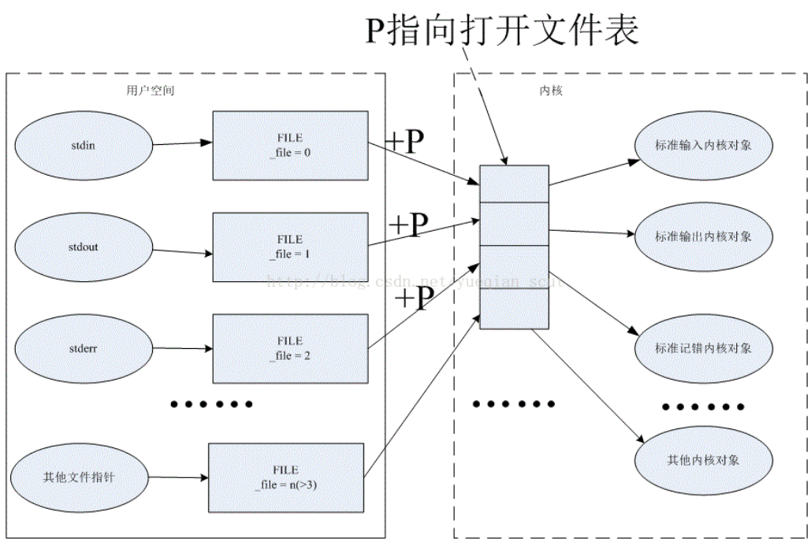

Printf其实是调用stdout指针在屏幕上输出
#define printf(args…) fprintf(stdout, ##args)
Args…表示变长输入参数。用以下四个宏根据栈来获取。
Va_list、Va_start、Va_arg、Va_end

5. 获取命令行参数和环境变量

6. 初始化C库的一些数据

7. 全局变量构造，如各个全局类对象的构造函数调用和标记 __attribute__((constructor))属性的各个函数。它们都应该在进入main前进行调用。
需要运行时库和C/C++编译器、连接器的配合才能实现这个功能。

1）编译器编译某个.cpp（设为main.cpp）文件时，会将所有的构造函数实现作为一个整体放到.init段，把析构函数实现放到.finit段，然后在.ctors段放置.init段的地址（该地址即是该文件的各个构造函数的总入口）。

2）运行时库有一个库是crtbegin.o，它的.ctors段放置的内容为-1，ctrend.o,它的.ctors段放置的内容也是-1。

3）用链接器进行连接:ld crtbegin.o main.o crtend.o一定要按这种顺序，否则出错。链接后的.ELF文件是将以上各个文件的.init/.finit/.ctors等段分别合并。当然.data/.text段也会相应合并。

全局变量构造时即是遍历.ctors段的内容，从-1（crtbegin.o）开始，再到-1(crtend.o)结束，中间每四个字节即是各个文件的构造入口函数指针，如果非0，即进行调用。


8. 注册析构函数
为了支持C++类的析构函数，和标记 __attribute__((deconstructor))属性的各个函数在main之后会被调用，而且是按构造的相反顺序进行调用，同样需要编译器和链接器以及运行时库的支持，原理跟构造相仿。只是为了逆序，使用了atexit注册各个虚构函数，注册时在链表头插入链接，main退出以后也从链表头开始获取链表函数，并进行调用。

9. 执行函数主体。
调用main函数执行，等待返回。在这里可以用到之前已经初始化的各种资源，如I/O, 堆申请释放等等

10. 调用析构函数

11. 释放堆
12. 释放其他资源

13. 调用exit系统API退出进程

# Linux进程地址空间

在Linux操作系统中，每个进程都有自己独立的地址空间。地址空间是指一个进程可以使用的虚拟内存范围。
虚拟内存的使用使得每个进程都可以认为自己在使用独立的内存空间，而实际上这些地址会被映射到物理内存中。
以下是Linux进程地址空间的主要组成部分及其作用：

1. 文本段（Text Segment）

内容：存储程序的可执行代码，即机器指令。

特点：通常是只读的，以防止程序意外修改其代码。此外，对于共享库来说，多个进程可以共享这段代码，从而节省内存。

2. 数据段（Data Segment）

内容：存储已初始化的全局变量和静态变量。

特点：分为读写部分和只读部分。已初始化的数据存储在这里，且在程序运行期间会持续存在。

3. BSS段（Block Started by Symbol）

内容：存储未初始化的全局变量和静态变量。

特点：这部分内存在程序开始运行时被初始化为零。

4. 堆（Heap）

内容：用于动态内存分配，程序运行时使用malloc、calloc、realloc等函数从堆中请求内存。

特点：堆的大小可以在程序运行时动态扩展或收缩。堆的顶端由brk系统调用控制，通常从低地址向高地址增长。

5. 栈（Stack）

内容：用于函数调用过程中的临时变量、参数、返回地址等。

特点：栈的大小也可以动态调整，但通常是从高地址向低地址增长。栈的内存分配和释放由编译器自动管理。

6. 内存映射段（Memory-mapped Segment）

内容：存储由mmap系统调用映射的文件或设备到内存，通常用于动态库、共享内存以及文件IO。

特点：允许文件直接映射到进程的地址空间，可以对文件进行快速访问和修改。

7. 核空间（Kernel Space）

内容：包含内核代码和数据，所有进程共享同一个内核空间。

特点：用户进程不能直接访问核空间，必须通过系统调用进行交互。

**进程地址空间示意图**

```plaintext
+---------------------+ 0xFFFFFFFF (顶端地址)
|    核空间 (内核)    |
+---------------------+
|    栈 (Stack)       |
|     ...             |
|                     |
|     v               |
|    成长             |
+---------------------+
|    共享库           |
+---------------------+
|    堆 (Heap)        |
|    成长             |
|     ^               |
|     ...             |
+---------------------+
|    BSS段            |
+---------------------+
|    数据段           |
+---------------------+
|    文本段           |
+---------------------+ 0x00000000 (底端地址)
```
进程地址空间的管理

分页机制：Linux使用分页机制来管理内存，每个进程的地址空间被划分为固定大小的页（通常为4KB）。虚拟地址通过页表映射到物理地址。

系统调用：进程通过brk和mmap系统调用来请求和释放内存，内核负责管理这些请求并维护进程的地址空间布局。

虚拟内存的优势

隔离性：每个进程都有自己的虚拟地址空间，互不干扰，提升了系统的稳定性和安全性。

灵活性：进程可以使用比实际物理内存更多的地址空间，通过内存映射、交换等机制提升内存使用效率。

简化编程：程序员不需要关心物理内存的实际布局，可以简单地使用虚拟地址进行编程。

通过虚拟内存和进程地址空间的管理，Linux系统能够高效地利用内存资源并提供安全隔离的运行环境。

# 虚拟内存地址

虚拟内存地址是指进程在其虚拟地址空间中使用的地址。
这些地址被映射到实际的物理内存地址，允许操作系统提供内存保护、内存隔离、和内存共享等功能。

以下是对虚拟内存地址及其相关概念的详细解释：

虚拟内存地址空间

每个进程在启动时被分配一个独立的虚拟地址空间。这个虚拟地址空间的大小取决于操作系统和硬件的架构。
例如，在32位系统中，虚拟地址空间通常为4GB（2^32字节），在64位系统中，虚拟地址空间可以非常大，通常为几TB甚至更大。

虚拟内存的管理

虚拟内存的管理涉及将虚拟地址映射到物理地址，这个过程由操作系统和硬件共同完成。主要通过以下机制实现：

分页（Paging）：

虚拟内存和物理内存都被划分为固定大小的块，称为页（page）和页框（page frame）。
常见的页大小为4KB。页表（page table）维护了虚拟地址到物理地址的映射关系。

分段（Segmentation）：

内存被划分为不同的段，每个段可以有不同的大小和访问权限。
段表（segment table）维护段的基址和大小等信息。

页表（Page Table）

页表是用来实现虚拟地址到物理地址映射的数据结构。
每个进程都有自己的页表，操作系统维护这些页表并在进程切换时更新硬件中的相关寄存器。

虚拟地址的结构

虚拟地址通常分为两部分：页号（Page Number）和页内偏移（Page Offset）。
页号用于查找页表中的对应项，而页内偏移用于确定在页内的具体地址。

虚拟内存的实现

地址转换：

当CPU需要访问某个虚拟地址时，首先通过页表查找对应的物理地址。
如果页表项存在，地址转换完成，CPU直接访问对应的物理地址。如果页表项不存在（缺页），操作系统处理缺页中断，将需要的页调入内存。

TLB（Translation Lookaside Buffer）：

为了提高地址转换的效率，现代处理器使用一个小型的硬件缓存，称为TLB。TLB存储最近使用的页表项，减少页表查找的开销。

内存保护和隔离

通过虚拟内存，操作系统能够实现内存保护和进程隔离：

内存保护：

操作系统可以设置每个页的访问权限（读、写、执行）。非法访问（如写入只读页）会导致内存访问异常，操作系统可以捕获并处理这种异常。

进程隔离：

每个进程拥有独立的虚拟地址空间，进程之间的内存互不干扰。这确保了一个进程的错误不会影响到其他进程。


共享内存

虽然每个进程有独立的虚拟地址空间，但可以通过内存映射机制实现共享内存。
例如，共享库和共享内存区域可以映射到多个进程的虚拟地址空间，实现内存共享和数据通信。

交换（Swapping）

当物理内存不足时，操作系统可以将一些不常用的页暂时写到磁盘（称为交换或分页交换），释放物理内存。
这些页在需要时再从磁盘读回内存。这种机制允许程序使用超过物理内存大小的虚拟内存。

总结

虚拟内存地址是操作系统提供的一个抽象，使每个进程可以使用独立的、连续的地址空间，而实际的物理内存是通过分页和分段等机制来管理的。
虚拟内存提供了内存保护、进程隔离、内存共享等重要功能，并通过页表和TLB等机制高效地实现地址转换和管理。

# 水平、边缘触发

epoll 是 Linux 内核中一种高效的 I/O 多路复用机制，常用于网络服务器的实现中。
epoll 有两种触发模式：水平触发（Level Triggered，LT）和边缘触发（Edge Triggered，ET）。这
两种模式在事件通知的方式和处理上有所不同。

水平触发（Level Triggered，LT）

特点：

这是 epoll 的默认模式。

当文件描述符上有事件发生时，无论何时只要文件描述符处于就绪状态，epoll_wait 都会通知你。

你不需要一次性处理所有的事件，可以在多次调用中处理。

只要条件满足，epoll_wait 会一直返回相同的事件。

边缘触发（Edge Triggered，ET）

特点：

提供更高的性能，但更复杂。

只有在文件描述符的状态发生变化时，epoll_wait 才会通知你。

必须一次性处理所有的事件，否则可能会丢失后续的事件通知。

适合高性能的网络服务器实现。

区别总结

水平触发（LT）：

更容易使用，适合大多数应用。

文件描述符就绪时会重复通知，直到事件被处理。

可以分多次处理，不要求一次性处理完所有数据。

边缘触发（ET）：

提供更高性能，但使用复杂。

只有在文件描述符状态变化时才通知，不会重复通知。

需要非阻塞 I/O，且必须一次性处理完所有数据，否则可能会丢失事件。

在高性能应用中，边缘触发模式更为常用，但要求编程时更加小心，确保所有数据都能及时处理。水平触发模式更为简单和安全，适合一般应用。

# 虚函数-内联

在C++中，虚函数（virtual function）和内联函数（inline function）是两种不同的概念。
它们的结合使用可能会让人疑惑，因为虚函数的动态绑定机制和内联函数的编译时展开机制有些冲突。
然而，它们是可以结合使用的，具体效果取决于编译器的实现。

虚函数

虚函数允许在运行时进行动态绑定，支持多态行为。当基类的指针或引用调用虚函数时，实际调用的是派生类中相应的重写函数。

内联函数

内联函数是在编译时请求编译器将函数的调用展开成函数体，以减少函数调用的开销。内联是一种建议，编译器可以选择忽略。

虚函数和内联函数的结合

尽管虚函数可以被声明为内联函数，但在实际使用中，内联函数的内联特性可能不会生效。
这是因为虚函数的动态绑定机制要求在运行时通过虚函数表（vtable）查找函数地址，从而阻止了编译时的内联展开。

```cpp
#include <iostream>

class Base {
public:
    virtual void show() const {
        std::cout << "Base class show function\n";
    }
};

class Derived : public Base {
public:
    virtual void show() const override {
        std::cout << "Derived class show function\n";
    }
};

int main() {
    Base* b = new Derived();
    b->show();  // 调用的是Derived类的show函数
    delete b;
    return 0;
}
```

在这个例子中，Base 类和 Derived 类都定义了一个虚函数 show。通过基类指针 b 调用 show 时，实际上调用的是 Derived 类的 show 函数。


将虚函数声明为内联函数

```cpp
class Base {
public:
    virtual void show() const {
        std::cout << "Base class show function\n";
    }
};

class Derived : public Base {
public:
    virtual void show() const override {
        std::cout << "Derived class show function\n";
    }
};

```

在这里，我们并没有显式地将函数声明为 inline，但这并不影响其效果。如果我们显式地声明虚函数为内联函数：

```cpp
class Base {
public:
    virtual inline void show() const {
        std::cout << "Base class show function\n";
    }
};

class Derived : public Base {
public:
    virtual inline void show() const override {
        std::cout << "Derived class show function\n";
    }
};

```

即使我们显式地声明虚函数为内联函数，编译器通常不会将其内联展开，因为虚函数的调用需要通过虚函数表进行动态绑定。

编译器的作用

内联是对编译器的一个建议，而不是强制命令。现代编译器会基于优化的需要决定是否将函数内联化。
对于虚函数，即使标记为内联，编译器可能仍然选择不内联这些函数，因为虚函数的调用需要在运行时解析，这与内联展开的编译时决策相冲突。

结论

虚函数支持运行时的多态行为，通过虚函数表实现动态绑定。

内联函数旨在减少函数调用开销，通过编译时展开实现。

虚函数可以被声明为内联函数，但由于虚函数的动态绑定机制，编译器通常不会将虚函数内联展开。

内联是对编译器的建议，实际内联决策由编译器基于优化需求做出。

综合来看，在设计和使用虚函数时，应主要关注其多态性特性，而不必过于关注内联优化，因为编译器会自动做出最佳决策。


虚函数和内联函数在C++中有着不同的用途和实现机制。
虽然它们可以在语法上结合使用，但在实际应用中，内联虚函数的内联化行为并不总是能如预期那样发生。

虚函数和内联函数

虚函数（Virtual Function）：支持多态性，通过虚函数表（vtable）实现动态绑定。具体调用哪个函数是在运行时决定的。

内联函数（Inline Function）：通过在编译时将函数调用展开为函数体，以减少函数调用的开销。内联是一种优化建议，编译器可以选择忽略。

虚函数能否被内联

**答案是：可以，但有条件限制。**

静态调用时：

当虚函数在编译时可以确定调用目标时，编译器可能会将其内联。例如，通过对象实例调用而非指针或引用调用时，编译器知道具体的对象类型，可以将函数内联。

动态调用时：

通过基类指针或引用调用虚函数时，必须通过虚函数表进行查找，编译器无法在编译时确定具体调用哪个函数，因此无法内联。

```cpp
#include <iostream>

class Base {
public:
    virtual void show() const {
        std::cout << "Base class show function\n";
    }
};

class Derived : public Base {
public:
    virtual void show() const override {
        std::cout << "Derived class show function\n";
    }
};

void callFunction(const Base& b) {
    b.show();  // 动态调用，无法内联
}

int main() {
    Base b;
    Derived d;

    b.show();  // 静态调用，可能被内联
    d.show();  // 静态调用，可能被内联

    callFunction(b);  // 动态调用，无法内联
    callFunction(d);  // 动态调用，无法内联

    return 0;
}

```

编译器行为

静态调用：

在 b.show() 和 d.show() 这样的静态调用中，编译器知道对象的确切类型，可能会将这些调用内联展开。

动态调用：

在 callFunction(b) 和 callFunction(d) 这样的动态调用中，编译器必须在运行时通过虚函数表确定具体的函数地址，因此不能内联。

内联虚函数的实现细节

编译器优化：

现代编译器可以对静态调用进行内联优化，尤其是在开启优化选项时（如 -O2 或 -O3）。

虚函数表（vtable）：

对于通过指针或引用的虚函数调用，需要通过虚函数表进行动态查找，这个过程阻止了内联展开。

内联虚函数的场景

内联虚函数在一些特定场景下仍然有意义：

静态绑定的虚函数：

当虚函数通过具体对象实例调用时，编译器可以确定具体类型，并可能进行内联优化。

基类中非虚函数调用：

如果基类中有非虚函数调用虚函数，并且这个调用可以静态确定类型，编译器可能会进行内联优化。

总结

虚函数可以在静态绑定的情况下被内联，但在动态绑定的情况下，无法进行内联。

内联是对编译器的优化建议，最终是否内联由编译器根据具体情况决定。

在设计虚函数时，应关注多态性和动态绑定特性，不应依赖内联优化。

通过理解这些机制，可以更好地设计和优化C++程序，使其既具备多态性的灵活性，又在可能的情况下利用内联优化提高性能。


# 右值引用使用场景

右值引用（rvalue references）是C++11引入的一个强大特性，用于优化性能和资源管理。
它主要用于实现移动语义（move semantics）和完美转发（perfect forwarding）。

1. 移动语义（Move Semantics）
2. 
移动语义允许对象的资源（如动态分配的内存、文件句柄等）从一个对象移动到另一个对象，而不是复制资源。
这显著提高了程序的性能，尤其是对于大对象的操作。

使用场景

避免不必要的拷贝：当对象的临时副本可以被转移时，使用右值引用可以避免昂贵的拷贝操作。

```cpp
#include <iostream>
#include <vector>

class LargeObject {
public:
    LargeObject() : data(new int[1000000]) {}
    ~LargeObject() { delete[] data; }

    // 移动构造函数
    LargeObject(LargeObject&& other) noexcept : data(other.data) {
        other.data = nullptr; // 避免析构时重复释放内存
    }

    // 移动赋值操作符
    LargeObject& operator=(LargeObject&& other) noexcept {
        if (this != &other) {
            delete[] data;
            data = other.data;
            other.data = nullptr;
        }
        return *this;
    }

private:
    int* data;
};

int main() {
    LargeObject obj1;
    LargeObject obj2 = std::move(obj1); // 使用移动构造函数
    LargeObject obj3;
    obj3 = std::move(obj2); // 使用移动赋值操作符

    return 0;
}
// 在这个例子中，通过实现移动构造函数和移动赋值操作符，可以高效地移动 LargeObject 对象，而不是进行昂贵的拷贝。
```

2. 完美转发（Perfect Forwarding）

完美转发是指将函数模板的参数精确地转发给另一个函数，无论这些参数是左值还是右值。右值引用结合 std::forward 可以实现完美转发。

使用场景

通用的工厂函数：实现一个函数模板，可以接受任何参数并将其转发给另一个构造函数或函数。

包装函数：实现一个通用的包装器函数，能够完美地转发参数。

```cpp
#include <iostream>
#include <utility>

void process(int& x) {
    std::cout << "Lvalue reference to int\n";
}

void process(int&& x) {
    std::cout << "Rvalue reference to int\n";
}

template <typename T>
void forwarder(T&& arg) {
    process(std::forward<T>(arg));
}

int main() {
    int a = 10;
    forwarder(a);        // 调用 process(int&)
    forwarder(20);       // 调用 process(int&&)

    return 0;
}
//在这个例子中，forwarder 函数模板能够完美地转发参数 arg 到 process 函数，无论 arg 是左值还是右值。
```

3. 避免不必要的临时对象

右值引用可以帮助避免创建不必要的临时对象，从而优化程序性能。

```cpp
#include <iostream>
#include <vector>
#include <utility>

class Container {
public:
    void addElement(std::vector<int>&& vec) {
        data = std::move(vec); // 直接移动，而不是拷贝
    }

private:
    std::vector<int> data;
};

int main() {
    Container c;
    std::vector<int> temp = {1, 2, 3, 4, 5};
    c.addElement(std::move(temp)); // 使用右值引用避免拷贝

    return 0;
}
//在这个例子中，通过右值引用，可以将临时 std::vector 移动到 Container 对象中，而不是进行拷贝。
```

4. 标识返回值

右值引用可以用来标识返回值，从而启用移动语义。

```cpp
#include <iostream>
#include <vector>

std::vector<int> createVector() {
    std::vector<int> vec = {1, 2, 3, 4, 5};
    return vec; // 返回值会被优化为移动而不是拷贝
}

int main() {
    std::vector<int> v = createVector();

    return 0;
}
//在这个例子中，createVector 返回一个临时 std::vector 对象。通过右值引用和移动语义，返回值优化为移动而不是拷贝，从而提高性能。
```

右值引用在C++中主要用于以下几个场景：

实现移动语义，避免不必要的拷贝，提高性能。

实现完美转发，确保函数模板能够正确地处理左值和右值参数。

避免不必要的临时对象，优化资源管理。

标识返回值，启用移动语义优化返回值。

# vector迭代器失效

在使用C++标准模板库（STL）中的std::vector时，有时会遇到迭代器失效的问题。
迭代器失效是指在容器进行某些操作后，之前获取的迭代器变得无效，再次使用这些迭代器会导致未定义行为。
这通常是因为容器的内部状态发生了变化，例如重新分配内存或修改元素顺序。了解哪些操作会导致迭代器失效非常重要，以避免程序中的错误。

导致迭代器失效的操作

重新分配内存（Reallocation）：

当std::vector的容量不足以容纳新元素时，插入新元素会导致重新分配内存。重新分配内存时，所有指向旧内存的迭代器、指针和引用都会失效。

插入或删除元素：

插入元素到std::vector的中间位置会使所有指向被插入位置之后的元素的迭代器失效。

删除元素会使所有指向被删除位置之后的元素的迭代器失效。

```cpp
#include <iostream>
#include <vector>

int main() {
    std::vector<int> vec;
    vec.reserve(2); // 预留空间，防止迭代器失效

    vec.push_back(1);
    vec.push_back(2);

    auto it = vec.begin(); // 获取迭代器
    std::cout << *it << std::endl; // 输出 1

    vec.push_back(3); // 可能导致重新分配内存，迭代器失效

    // 使用失效的迭代器是未定义行为
    std::cout << *it << std::endl; // 这可能会导致未定义行为

    return 0;
}

#include <iostream>
#include <vector>

int main() {
    std::vector<int> vec = {1, 2, 3, 4, 5};

    auto it = vec.begin() + 2; // 指向元素 3
    std::cout << *it << std::endl; // 输出 3

    vec.insert(vec.begin() + 1, 0); // 插入元素，迭代器失效

    // 使用失效的迭代器是未定义行为
    std::cout << *it << std::endl; // 这可能会导致未定义行为

    return 0;
}

#include <iostream>
#include <vector>

int main() {
    std::vector<int> vec = {1, 2, 3, 4, 5};

    auto it = vec.begin() + 2; // 指向元素 3
    std::cout << *it << std::endl; // 输出 3

    vec.erase(vec.begin() + 1); // 删除元素，迭代器失效

    // 使用失效的迭代器是未定义行为
    std::cout << *it << std::endl; // 这可能会导致未定义行为

    return 0;
}

```

避免迭代器失效的策略

重新获取迭代器：

在执行可能导致迭代器失效的操作后，重新获取需要的迭代器。

使用索引而不是迭代器：

在某些情况下，可以使用索引而不是迭代器来访问std::vector的元素，因为索引在重新分配内存后仍然有效。

预留足够的空间：

使用std::vector::reserve预留足够的空间以避免重新分配内存。例如，在大量插入操作前预留足够的容量。

```cpp
#include <iostream>
#include <vector>

int main() {
    std::vector<int> vec = {1, 2, 3, 4, 5};

    auto it = vec.begin() + 2; // 指向元素 3
    std::cout << *it << std::endl; // 输出 3

    vec.insert(vec.begin() + 1, 0); // 插入元素，迭代器失效

    it = vec.begin() + 3; // 重新获取迭代器
    std::cout << *it << std::endl; // 输出 3

    return 0;
}

#include <iostream>
#include <vector>

int main() {
    std::vector<int> vec = {1, 2, 3, 4, 5};

    size_t index = 2; // 使用索引而不是迭代器
    std::cout << vec[index] << std::endl; // 输出 3

    vec.insert(vec.begin() + 1, 0); // 插入元素

    std::cout << vec[index + 1] << std::endl; // 输出 3

    return 0;
}

```


# HTTP、TCP区别

HTTP（Hypertext Transfer Protocol）和TCP（Transmission Control Protocol）是网络通信中常用的两种协议，但它们在功能和层次上有明显的区别。

TCP（Transmission Control Protocol）

概述

层次：TCP是传输层协议。

功能：提供可靠的、面向连接的字节流服务。

特点：

连接建立：通过三次握手建立连接。

数据传输：确保数据按顺序、无差错地传输。

流量控制：防止发送方发送过多数据淹没接收方。

拥塞控制：防止网络过载。

错误检测：使用校验和（checksum）检测传输错误。

工作流程

三次握手建立连接：

第一次握手：客户端发送SYN（同步）包。

第二次握手：服务器收到SYN包，回复SYN+ACK（确认）包。

第三次握手：客户端收到SYN+ACK包，发送ACK包，连接建立。

数据传输：

数据通过TCP连接传输，确保顺序和完整性。

使用序列号和确认号进行数据包的顺序控制和确认。

四次挥手断开连接：

第一次挥手：客户端发送FIN（终止）包，表示终止连接。

第二次挥手：服务器收到FIN包，回复ACK包。

第三次挥手：服务器发送FIN包，表示同意断开连接。

第四次挥手：客户端收到FIN包，回复ACK包，连接断开。

HTTP（Hypertext Transfer Protocol）

概述

层次：HTTP是应用层协议。

功能：用于传输网页数据和资源，定义了客户端和服务器之间的请求和响应格式。

特点：

无状态：每个请求和响应都是独立的，不保留之前的请求或响应状态。

基于请求-响应模型：客户端发送请求，服务器返回响应。

灵活：支持多种数据格式（HTML、JSON、XML等）。

可扩展：通过头字段（headers）扩展功能（如缓存控制、内容类型等）。

工作流程

1客户端发送请求：

客户端（如浏览器）向服务器发送HTTP请求，包含请求行（如GET/POST）、请求头和请求体。

2服务器处理请求：

服务器接收请求，处理请求内容，生成响应。

3服务器发送响应：

服务器将响应返回客户端，包含状态行、响应头和响应体。

4客户端接收响应：

客户端接收并处理服务器的响应，呈现网页或执行操作。

HTTP版本

HTTP/1.0：每个请求/响应都使用独立的TCP连接。

HTTP/1.1：引入了持久连接（Persistent Connection），可以在一个TCP连接上处理多个请求和响应，减少连接开销。

HTTP/2：引入了多路复用（Multiplexing），允许多个请求和响应同时在一个TCP连接上传输，提高效率。

HTTP/3：基于QUIC协议，使用UDP代替TCP，进一步减少延迟和提高传输性能。

对比总结

特性	TCP	HTTP

层次	传输层协议	应用层协议

功能	提供可靠的字节流传输	传输网页数据和资源

连接管理	通过三次握手建立连接、四次挥手断开连接	基于请求-响应模型，通常无状态

可靠性	保证数据的顺序、完整性和可靠传输	依赖于底层的传输协议（通常是TCP）

使用场景	网络数据传输的基础	Web浏览和API通信等

特点	面向连接、可靠传输、流量控制和拥塞控制	无状态、灵活、可扩展


关系

HTTP通常运行在TCP之上：HTTP依赖于TCP来提供可靠的传输服务。每个HTTP请求和响应都通过TCP连接进行传输。

TCP提供传输层服务，HTTP提供应用层服务：TCP负责数据传输的可靠性和顺序，HTTP负责数据的格式和交互逻辑。

通过了解HTTP和TCP的区别及其各自的特点和工作流程，可以更好地设计和优化网络通信应用，提高性能和可靠性。

# 析构函数 内存、功能 虚函数

析构函数可以是虚函数。在C++中，析构函数为虚函数在某些情况下是非常重要的，特别是当你使用继承和多态时。

将基类的析构函数声明为虚函数可以确保在删除派生类对象时，会正确调用派生类的析构函数，从而避免内存泄漏和其他资源管理问题。

为什么需要虚析构函数

当你使用指向基类的指针删除派生类对象时，如果基类的析构函数不是虚函数，只有基类的析构函数会被调用，而派生类的析构函数不会被调用。

这会导致派生类对象中的资源没有被正确释放。

```cpp
#include <iostream>

class Base {
public:
    Base() { std::cout << "Base constructor\n"; }
    ~Base() { std::cout << "Base destructor\n"; }
};

class Derived : public Base {
public:
    Derived() { std::cout << "Derived constructor\n"; }
    ~Derived() { std::cout << "Derived destructor\n"; }
};

int main() {
    Base* obj = new Derived();
    delete obj; // 只调用Base的析构函数，导致Derived的析构函数不被调用
    return 0;
}

```

在这个示例中，delete obj 只会调用 Base 的析构函数，而不会调用 Derived 的析构函数。
这可能导致 Derived 类中分配的资源没有被释放。

使用虚析构函数

通过将基类的析构函数声明为虚函数，可以确保在删除派生类对象时，会正确调用派生类的析构函数。


```cpp
#include <iostream>

class Base {
public:
    Base() { std::cout << "Base constructor\n"; }
    virtual ~Base() { std::cout << "Base destructor\n"; } // 虚析构函数
};

class Derived : public Base {
public:
    Derived() { std::cout << "Derived constructor\n"; }
    ~Derived() { std::cout << "Derived destructor\n"; }
};

int main() {
    Base* obj = new Derived();
    delete obj; // 现在会正确调用Derived的析构函数
    return 0;
}

```

在这个示例中，delete obj 会先调用 Derived 的析构函数，然后调用 Base 的析构函数，确保所有资源都被正确释放。

继承层次中的虚析构函数

在有多个继承层次的情况下，虚析构函数同样适用。例如：

```cpp
#include <iostream>

class Base {
public:
    Base() { std::cout << "Base constructor\n"; }
    virtual ~Base() { std::cout << "Base destructor\n"; }
};

class Intermediate : public Base {
public:
    Intermediate() { std::cout << "Intermediate constructor\n"; }
    ~Intermediate() { std::cout << "Intermediate destructor\n"; }
};

class Derived : public Intermediate {
public:
    Derived() { std::cout << "Derived constructor\n"; }
    ~Derived() { std::cout << "Derived destructor\n"; }
};

int main() {
    Base* obj = new Derived();
    delete obj; // 会按顺序调用Derived、Intermediate、Base的析构函数
    return 0;
}

```

在这个示例中，delete obj 会按顺序调用 Derived、Intermediate 和 Base 的析构函数，确保所有对象的析构函数都被正确调用。

总结

虚析构函数的必要性：当基类指针指向派生类对象，并且通过基类指针删除对象时，必须将基类的析构函数声明为虚函数，以确保正确调用派生类的析构函数。

继承和多态的关键：虚析构函数是使用多态和继承时确保资源正确释放的关键机制。

使用建议：在设计基类时，如果类可能会被继承且存在通过基类指针删除对象的情况，应将析构函数声明为虚函数。

通过理解和正确使用虚析构函数，可以避免许多常见的内存管理和资源释放问题，编写更健壮和可靠的C++代码。